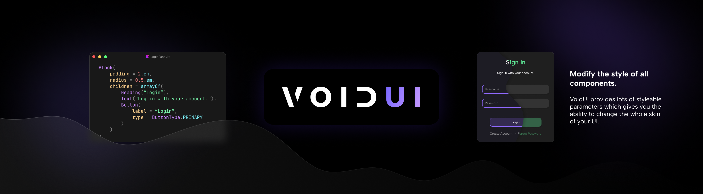
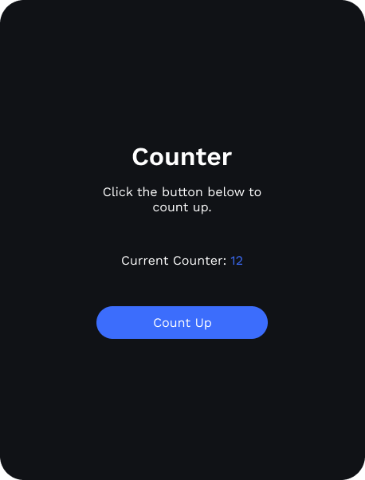

# VoidUI
⚠️ Work In Progress ⚠️

A declarative and themable UI library with easry integration into Minecraft.
It is used in Neptune client and will be to create extensions for Neptune in the future.
The way we are designing VoidUI is that we want a developer experience similar to [Flutter](https://flutter.dev/) but
with pure Kotlin so the UI can be integrated easily with a Minecraft Java mod.\
The code snipped below shows how an implementation of VoidUI could look like:

```kotlin
class UICounter : ReactiveComponent {

  var count = 0

  override fun build(): Component {
    return Column(
      width = 215.px,
      gap = 3.rem,
      children = arrayOf(
        Column(
          gap = 1.rem,
          children = arrayOf(
            Title("Counter"),
            Text("Click the button below to count up."),
          )
        ),
        ColorizedText(
          text = mapOf(
            "Current Counter: " to Color.WHITE,
            "$count" to Color.PRIMARY
          )
        ),
        Button(
          label = "Count Up",
          onClick = { event ->
            count++
          }
        )
      )
    )
  }

}
```

This is what the above code could look like:\

