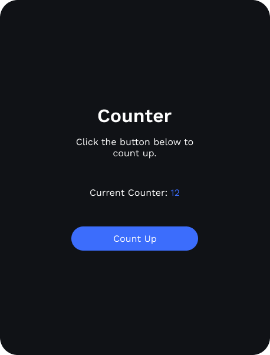

# VoidUI
⚠️ Work In Progress ⚠️

A declarative and themable UI library with easy integration into Minecraft.
It is used in Neptune client and will be used to create extensions for Neptune in the future.
The way we are designing VoidUI is that we want a developer experience similar to [Flutter](https://flutter.dev/) but
with pure Kotlin so the UI can be integrated easily with a Minecraft Java mod.\
The code snipped below shows how an implementation of VoidUI could look like:

```kotlin
class UICounter : ReactiveComponent {

  // define a variable which rebuilds the component on change
  var count by state(0)

  override fun build(): Component {
    return Column(
      width = 215.px,
      gap = 3.rem,
      children = arrayOf(
        Column(
          gap = 1.rem,
          children = arrayOf(
            Title("Counter"),
            Text("Click the button below to count up."),
          )
        ),
        ColorizedText(
          text = mapOf(
            "Current Counter: " to Color.WHITE,
            "$count" to Color.PRIMARY
          )
        ),
        Button(
          label = "Count Up",
          onClick = { event ->
            count++
          }
        )
      )
    )
  }

}
```

This is what the above code could look like:\


### Structure
The UI components in Void are seperated into three categories:

- **Elements**\
  Elements are the core components of Void, which are sometimes reactive,
  like a dropdown menu or a checkbox, and sometimes static, like a heading
  or an image. They can not be created by the user of the library.
- **Static Components**\
  Components are small trees of other components and elements, which can be useful
  if the user needs to reuse parts of the ui multiple times. Static components
  can not have state and can't chane on certain events.
- **Reactive Components**\
  Reactive components are like static components, but they can change their state
  and display something else based on an event. Reactive components are similar
  to how components work in JavaScript frameworks like React.

**Screens**\
There are also screens in Void which are like static components but wrap their
children with a centered layout which covers the whole display. Screens can also
be displayed to the user.\
The way Void is structured with separating components and screens is part of what
makes it easy to integrate into Minecraft.
