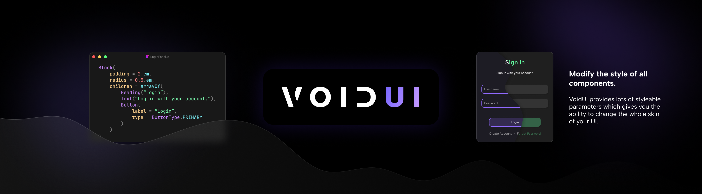

# VoidUI
⚠️ Work In Progress ⚠️

A declarative and themeable UI framework designed to create reactive user interfaces
in Minecraft easily. The main intention of the project is to be used in Neptune client
as well as a developer tool for the Neptune Add-On API in the future.

VoidUI tries to mimic the DSL of [Flutter](https://flutter.dev/) in some ways, but
it adds its own _flavour_ in some places.

### Usage
Unlike Flutter, VoidUI is structured into screens, which contain widgets. This is
done to make the integration into Minecraft more accessible, since Minecraft is
structured into screens and UI components as well. It also does not offer a way
to display these screens by default but more on that in the
[Integration](#integration) section.

All of your code in VoidUI is written in Kotlin. An implementation of a basic
screen could look like this:
```kotlin
class TestScreen(voidUI: VoidUI) : Screen(voidUI) {

    // build the screen
    override fun build(): Widget {
        return Container(
            color = Color.WHITE,
            cornerRadius = CornerRadius.all(10f),
            padding = EdgeInsets.all(20f),

            child = Column(
                gap = 20f,
                crossAxisAlignment = CrossAxisAlignment.STRETCH,
                children = arrayOf(
                    Button("Singleplayer"),
                    Button("Multiplayer")
                )
            )
        )
    }

}
```

As you can see when creating an instance of this screen, you need to pass in an object
of the ``VoidUI`` class. To do that, you need to first have a renderer implemented
(see [Integration](#integration) again for that) and a theme. It could look something
like this:
```kotlin
val voidUI = VoidUI(
  renderer = MyRendererImpl(),
  theme = MyTheme(),
  
  // these are optional arguments
  settings = Settings(/*assign custom settings in the constructor*/),
  template = Template { slot ->
    /*build a custom widget tree, that wraps every screen you create*/
    slot
  }
)
```

### Integration
When using VoidUI outside of Neptune client, you will need to integrate the library
into your project first. This means that events and methods from the library need
to be called or implemented in your codebase so, that VoidUI can perform actions
such as rendering, or detecting mouse clicks.

While this offers a great variety of use cases for VoidUI, it can be a bit
overwhelming when doing it for the first time, so this is a list of all the things
you need to do, before you will be able to use all features of the library:

- **Implement a renderer**\
  The library does not offer a way to render things to the screen by default,
  so you will have to implement all the methods for rendering by yourself.
  Alternatively you can look at the [example mod]() for a renderer which works for Minecraft.

- **Create a theme**\
  The theme is what tells VoidUI how to style certain components of the UI.
  Again you can check out the example when you feel lost or don't want to write all
  these settings on your own.

- **Call extern events**\
  VoidUI uses an event system to handle actions like mouse clicks or keyboard presses.
  Because it does not implement handlers for this by default events like
  ``MouseClickedEvent`` and ``KeyPressedEvent`` need to be called by the user at
  the appropriate location in the code base.

### Contribution
If you find a bug while using VoidUI or you think it is missing a key feature,
please feel free to open a pull request and contribute to the project. We
appreciate all support by the community.

---
**Proper documentation will be there eventually**
